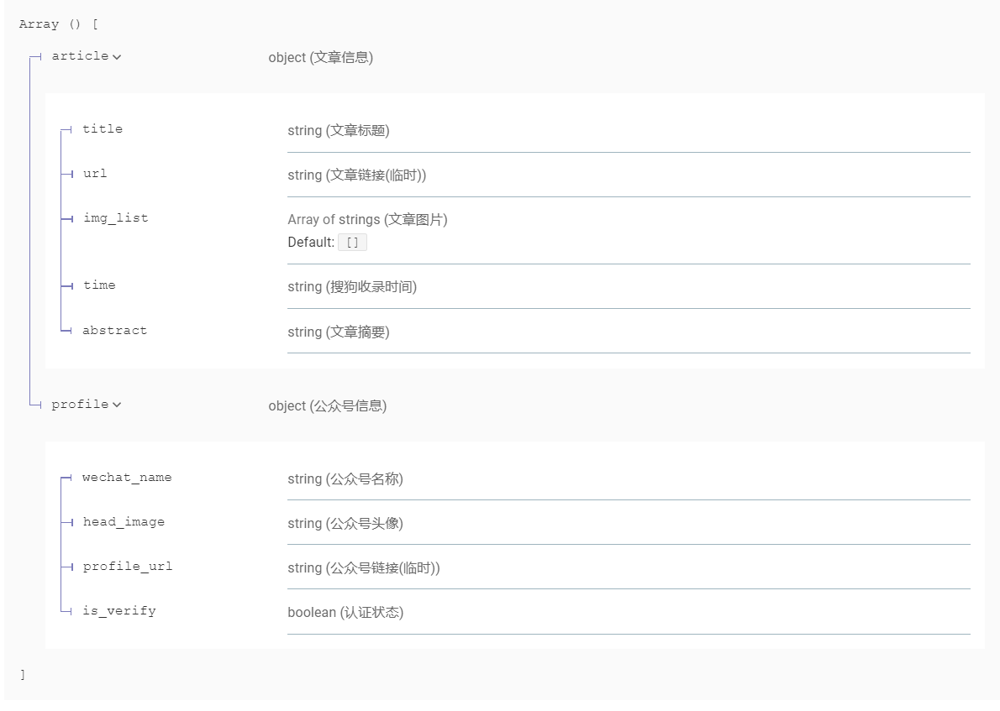
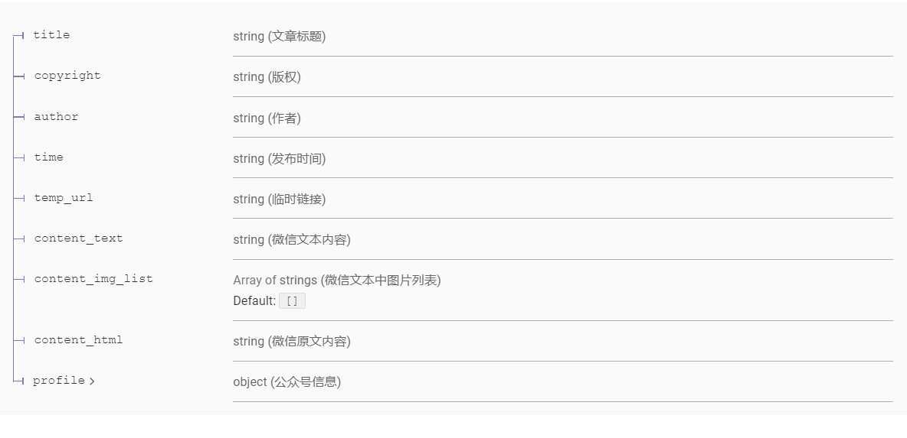
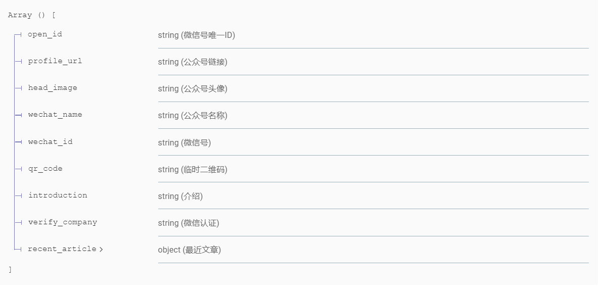
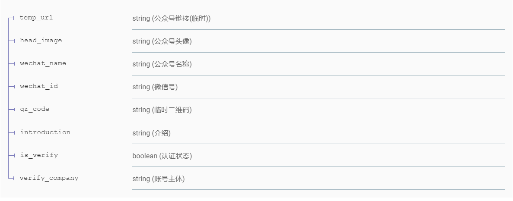

基于搜狗微信搜索的爬虫接口
===

项目介绍
----------

基于[搜狗微信](https://weixin.sogou.com)搜索写的爬虫接口，接口基于[FastAPI](https://github.com/tiangolo/fastapi)开发。

### 接口文档

- [Swagger](http://weixin.iszhouhua.com/docs)
- [ReDoc](http://weixin.iszhouhua.com/redoc)

### 示例

#### 文章搜索

```bash
curl -X 'GET' \
  'http://weixin.iszhouhua.com/article/search?keyword=%E5%8E%9F%E5%88%9B&page=1' \
  -H 'accept: application/json'
```

Response

```json
{
	"code": 200,
	"message": "OK",
	"data": [{
		"article": {
			"title": "【原创】鱼趣",
			"url": "https://weixin.sogou.com/link?url=dn9a_-gY295K0Rci_xozVXfdMkSQTLW6cwJThYulHEtVjXrGTiVgS8p3pevogA-dYWIVoceVKBiD1YSoL8w7p1qXa8Fplpd9eHg4YlLwWqNxlOOicHbsEw6H9H0zDLmYUfbAsgMNc3gKrQxCFu5cDDwUrfPqiz8WIBLjz40WqwRwUw8v3Pm12I4RtA2rIibaDS_s93Ez4mfqKIoqGe8504OEyPY_NDNNFJs-VX6dOYv2coEKkI5yRIWEQ5_si1vf2womO5t1BsEHpHkoPMgL3A..&type=2&query=%E5%8E%9F%E5%88%9B&token=4C6A67C82C42B0F5DBDE1015DA3C6B3DDB06AF63613E1D45",
			"img_list": [
				"https://img01.sogoucdn.com/net/a/04/link?appid=100520033&url=http://mmbiz.qpic.cn/mmbiz_jpg/O7GxtnRq8rVvLMQWIAULBwjmGia9vJab8FHBdDc7wtLOk8M2qCwO9Iry3ibJ5AbsTW7I1UvdQDczQFjxcno8UdHQ/0?wx_fmt=jpeg"
			],
			"time": "2021-09-03 09:00:56",
			"abstract": "鱼  趣文/;李建军我颇喜欢钓鱼,几十年的阅历了.在钓鱼中,逐渐地对鱼的习性有所了解,有所感悟,发现了许多有趣的事,在这里..."
		},
		"profile": {
			"wechat_name": "清新园地",
			"head_image": "http://wx.qlogo.cn/mmhead/Q3auHgzwzM4tkSRggqWuwGL4soDhiblVna8zFb6tMNqbYBiaic3KDn0Qg/0",
			"profile_url": "https://weixin.sogou.com/link?url=dn9a_-gY295K0Rci_xozVXfdMkSQTLW6EzDJysI4ql5MPrOUp16838dGRMI7NnPq0jnnAKXsSESfGJVYaQHAsQwvDqyjOWdzHwi15odDQPIEsw2pk7lTvWRT3mgku2_qeQShCO5bz4FBkWSBLSEc0r9TzFPi5seLTJjinL3i4JWHNugUmHciebaOA1anFBi-QYMN9Z9m9uKu23xEWNPCi6UiiWOv1GPM&type=2&query=%E5%8E%9F%E5%88%9B&token=4C6A67C82C42B0F5DBDE1015DA3C6B3DDB06AF63613E1D45",
			"is_verify": false
		}
	}]
}
```

返回数据结构



#### 文章详情

```bash
curl -X 'GET' \
  'http://weixin.iszhouhua.com/article/detail?url=https%3A%2F%2Fmp.weixin.qq.com%2Fs%3Fsrc%3D11%26timestamp%3D1631460036%26ver%3D3310%26signature%3Dv%2AUCSY9AxXThYDWPNKzJCESO0DE4IMaewMyINQq4-3Z44K1BIJFqQA5TdX92Ly9jyHNT4g1pP7xweawlKer2chuXpa6q%2AKqTtiP4LIFwGnioKiKd7nQxTr7GeTmomw0F%26new%3D1' \
  -H 'accept: application/json'
```

Response

```json
{
  "code": 200,
  "message": "OK",
  "data": {
    "title": "【原创】鱼趣",
    "copyright": "原创",
    "author": "李建军",
    "time": "2021-09-03 09:00:00",
    "temp_url": "https://mp.weixin.qq.com/s?src=11&timestamp=1631460036&ver=3310&signature=v*UCSY9AxXThYDWPNKzJCESO0DE4IMaewMyINQq4-3Z44K1BIJFqQA5TdX92Ly9jyHNT4g1pP7xweawlKer2chuXpa6q*KqTtiP4LIFwGnioKiKd7nQxTr7GeTmomw0F&new=1",
    "content_text": "点击上方蓝字关注清新园地 |第895-1期鱼  趣文/；李建军我颇喜欢钓鱼，几十年的阅历了。在钓鱼中，逐渐地对鱼的习性有所了解，有所感悟，发现了许多有趣的事，在这里与大家分享。你们听说过吗？鱼的记忆只有七秒，它一转身就忘记了痛苦，所以鱼总是快乐地在水漫游。开始我不信，后来在钓鱼时发现，刚钓上来一条，然后挂上蚯蚓，垂入水中，连七秒都没有，又有鱼儿上钩，鱼真忘记了，刚才那条鱼咋被钓上来的。我还发现一趣事，钓鱼时都是一波一波的，如果你钓上来一条鱼，准能钓上第二条第三条……这是因为，鱼和个人一样，也喜欢一起逛街游玩。一条鱼丢了，那些鱼原地不走，就会找那条丢失的鱼，所以鱼越找越少。有一事一直不明白，钓上来的鱼，总是养不活，十分遗憾。有人说鱼出水时，眼睛被光刺伤所致。还有人说，鱼被钩弄伤了唇感染所致等等，无论啥原因，就是养不活，我很纳闷？鱼生于水长于水，鱼离不开水。可以说鱼水情深，达到了亲密无间地步，鱼那么信任水，最后，水却煮了鱼。就像叶子那么信任风，风却吹落了叶。鱼非常伤心。鱼真的离不开水吗？听说非洲沙漠有一种肺鱼，经过千万年演变，从大海爬上陆地，变成两栖鱼类；又从淡水鱼，逐渐适应了沙漠的干旱，这要经过多少磨难与坚强，这要经过多少生与死的成长，最终离开了水，仍可以在泥土里成活四年。待到雨季来临，它又可以重生，这是多么伟大的生灵。不是鱼离不开水，不是花离不开秧。生命中没有谁离不开谁，如果你不被珍惜，就已经不再重要了，一定要学会华丽转身。今天的泪水会是你明天的坚强，今天的伤痕会是你明天的成长。作者：李建军【清新园地】专栏作者，生在乌苏里江畔，童年长在黄土高原，少年时随父亲转业回到祖籍河北邯郸，养成东北人的朴实豪迈、西北人的憨厚热情，给爱好写作增添了不少感情色彩。喜欢古诗、散文、摄影、小小说、新闻报道，在全国报纸杂志发表各类作品千余篇。",
    "content_img_list": [
      "https://mmbiz.qpic.cn/mmbiz_jpg/O7GxtnRq8rVvLMQWIAULBwjmGia9vJab8wR368F4zJDcQZcCLwlAicRiahNibEibrDWqACiameyyg6zgoorMTA8sY7tw/640?wx_fmt=jpeg",
      "https://mmbiz.qpic.cn/mmbiz_jpg/O7GxtnRq8rVvLMQWIAULBwjmGia9vJab85JpwFulW3J46aU6SJPpKdaoA6IzJMCYv7El6rDu4LIkH5bXwKjSCkQ/640?wx_fmt=jpeg",
      "https://mmbiz.qpic.cn/mmbiz_jpg/O7GxtnRq8rVvLMQWIAULBwjmGia9vJab8ACaNRFoZianXhL2RT5kkSuddTSVvwkg3IibWdic5eWfz767JMxSaibwCEg/640?wx_fmt=jpeg"
    ],
    "content_html": "<div class=\"rich_media_content \" id=\"js_content\" style=\"visibility: hidden;\">\n                    \n\n                    \n                    \n                    \n                    <p style=\"text-align: center;\"><strong style=\"text-align: center;white-space: normal;text-indent: 34px;widows: 1;font-size: 14px;background-color: rgb(255, 255, 255);color: rgb(112, 48, 93);font-family: -apple-system, BlinkMacSystemFont, &quot;Helvetica Neue&quot;, &quot;PingFang SC&quot;, &quot;Hiragino Sans GB&quot;, &quot;Microsoft YaHei UI&quot;, &quot;Microsoft YaHei&quot;, Arial, sans-serif;letter-spacing: 0.544px;max-width: 100%;box-sizing: border-box;overflow-wrap: break-word !important;\"><strong style=\"font-family: 微软雅黑;font-size: 13.3333px;letter-spacing: 0.544px;color: rgb(123, 12, 0);\"><strong><strong style=\"font-size: 12px;color: rgb(122, 68, 66);\"><strong style=\"background-color: rgb(251, 253, 243);color: rgb(123, 12, 0);\"><strong style=\"font-family: -apple-system, BlinkMacSystemFont, &quot;Helvetica Neue&quot;, &quot;PingFang SC&quot;, &quot;Hiragino Sans GB&quot;, &quot;Microsoft YaHei UI&quot;, &quot;Microsoft YaHei&quot;, Arial, sans-serif;background-color: rgb(255, 255, 255);color: rgb(171, 25, 66);\"><strong style=\"letter-spacing: 0.544px;color: rgb(214, 168, 65);\"><strong><span style=\"color: rgb(0, 0, 0);line-height: 32px;max-width: none;overflow-wrap: break-word;box-sizing: content-box;min-height: 0px;background-image: none;background-clip: border-box;background-position: 0% 0%;background-repeat: repeat;background-size: auto;border-width: 0px;border-style: none;border-color: rgb(122, 68, 66);bottom: auto;height: auto;left: auto;max-height: none;min-width: 0px;text-decoration-style: solid;text-decoration-color: rgb(122, 68, 66);top: auto;z-index: auto;visibility: visible;clear: none;font-family: 微软雅黑;\">点击上方蓝字关注清新园地 |第895-1期</span></strong></strong></strong></strong></strong></strong></strong> </strong></p><p></p><p style=\"text-align: center;\"><br/></p><p style=\"text-align: center;\"><em><span style=\"color: rgb(214, 168, 65);\"><strong>鱼  趣</strong></span></em></p><p style=\"text-align: center;\"><span style=\"font-size: 12px;color: rgb(0, 0, 0);\">文/；李建军</span></p><p><br/></p><p><span style=\"font-size: 15px;letter-spacing: 1px;\">我颇喜欢钓鱼，几十年的阅历了。在钓鱼中，逐渐地对鱼的习性有所了解，有所感悟，发现了许多有趣的事，在这里与大家分享。</span></p><p><br/></p><p><span style=\"font-size: 15px;letter-spacing: 1px;\">你们听说过吗？鱼的记忆只有七秒，它一转身就忘记了痛苦，所以鱼总是快乐地在水漫游。开始我不信，后来在钓鱼时发现，刚钓上来一条，然后挂上蚯蚓，垂入水中，连七秒都没有，又有鱼儿上钩，鱼真忘记了，刚才那条鱼咋被钓上来的。</span></p><p><br/></p><p><span style=\"font-size: 15px;letter-spacing: 1px;\">我还发现一趣事，钓鱼时都是一波一波的，如果你钓上来一条鱼，准能钓上第二条第三条……这是因为，鱼和个人一样，也喜欢一起逛街游玩。一条鱼丢了，那些鱼原地不走，就会找那条丢失的鱼，所以鱼越找越少。</span></p><p><br/></p><p></p><p><br/></p><p><span style=\"font-size: 15px;letter-spacing: 1px;\">有一事一直不明白，钓上来的鱼，总是养不活，十分遗憾。有人说鱼出水时，眼睛被光刺伤所致。还有人说，鱼被钩弄伤了唇感染所致等等，无论啥原因，就是养不活，我很纳闷？</span></p><p><br/></p><p><span style=\"font-size: 15px;letter-spacing: 1px;\">鱼生于水长于水，鱼离不开水。可以说鱼水情深，达到了亲密无间地步，鱼那么信任水，最后，水却煮了鱼。就像叶子那么信任风，风却吹落了叶。鱼非常伤心。</span></p><p><br/></p><p><span style=\"font-size: 15px;letter-spacing: 1px;\">鱼真的离不开水吗？听说非洲沙漠有一种肺鱼，经过千万年演变，从大海爬上陆地，变成两栖鱼类；又从淡水鱼，逐渐适应了沙漠的干旱，这要经过多少磨难与坚强，这要经过多少生与死的成长，最终离开了水，仍可以在泥土里成活四年。待到雨季来临，它又可以重生，这是多么伟大的生灵。</span></p><p><br/></p><p><span style=\"font-size: 15px;letter-spacing: 1px;\">不是鱼离不开水，不是花离不开秧。生命中没有谁离不开谁，如果你不被珍惜，就已经不再重要了，一定要学会华丽转身。今天的泪水会是你明天的坚强，今天的伤痕会是你明天的成长。</span></p><p><br/></p><p></p><p style=\"margin-bottom: 0.1px;\"><span style=\"font-size: 12px;\"><strong><span style=\"font-size: 12px;font-family: 微软雅黑, sans-serif;color: black;\">作者：李建军【清新园地】专栏作者，</span></strong><span style=\"font-size: 12px;font-family: 微软雅黑, sans-serif;color: black;\">生在乌苏里江畔，童年长在黄土高原，少年时随父亲转业回到祖籍河北邯郸，养成东北人的朴实豪迈、西北人的憨厚热情，给爱好写作增添了不少感情色彩。喜欢古诗、散文、摄影、小小说、新闻报道，在全国报纸杂志发表各类作品千余篇。</span></span></p>\n                </div>\n\n                ",
    "profile": {
      "wechat_name": "清新园地",
      "wechat_id": "sjmy1017",
      "qr_code": "https://mp.weixin.qq.com/rr?timestamp=1631460658&src=11&ver=1&signature=PgvIDqYFH7qSgal*1ic-XkG6UwPf6tKcjhV5IuhDudJbgZvqW-BtDqo1YLq0QIH7UQtXI7sYHisdpAeO0pVSNzZPqScF79dYayPgZMeilA0=",
      "introduction": "阅一段光阴，读一份懂得，走过尘世喧嚣。时光深处，岁月静美，你在我在！"
    }
  }
}
```

返回数据结构



#### 公众号搜索

```bash
curl -X 'GET' \
  'http://weixin.iszhouhua.com/profile/search?keyword=%E5%BE%AE%E4%BF%A1&page=1' \
  -H 'accept: application/json'
```

Response

```json
{
	"code": 200,
	"message": "OK",
	"data": [{
		"open_id": "oIWsFtzJc3ridLD0NCXZ5lnNSoTk",
		"profile_url": "https://weixin.sogou.com/link?url=dn9a_-gY295K0Rci_xozVXfdMkSQTLW6EzDJysI4ql5MPrOUp16838dGRMI7NnPqfZG0hTMmAstel-BzvDazdAwvDqyjOWdz-Pm_VdS5FPryVTbrpPjpLgLnDOHarsDLVMnsTAuKR6aahnq5VGRQ58TTMOmoA4axXdId1nG8M18PHBSyzdLvGPtR4Dk_k0XOw3mxJBlAC9tH9nUD9_0SSuO00efWrWmm&type=1&query=%E5%BE%AE%E4%BF%A1&token=4C68255BCBA357143C39F0F1C7573B653C10AD3A613E1C5F",
		"head_image": "https://img01.sogoucdn.com/app/a/100520090/oIWsFtzJc3ridLD0NCXZ5lnNSoTk",
		"wechat_name": "微信派",
		"wechat_id": "wx-pai",
		"qr_code": "https://img01.sogoucdn.com/v2/thumb?t=2&url=http%3A%2F%2Fmp.weixin.qq.com%2Frr%3Fsrc%3D3%26timestamp%3D1631460447%26ver%3D1%26signature%3D-ovl5yC4WttL13vQjFyd6JuFtP8jOscFOm6GjeblSeufY7O6G2GmiSfYz4VNozoPmr5t3D13kcWwJ8QIyNhMIXjPcEiltJVGurcCw2cVtuM%3D&appid=200580",
		"introduction": "微信官方信息第一出口",
		"verify_company": "深圳市腾讯计算机系统有限公司",
		"recent_article": {
			"title": "微信状态,可以K歌了!",
			"url": "https://weixin.sogou.com/link?url=dn9a_-gY295K0Rci_xozVXfdMkSQTLW6cwJThYulHEtVjXrGTiVgS8p3pevogA-d5cSIhA_7aG6D1YSoL8w7p1qXa8Fplpd9ZYkIPiiLL-AJtlOjX6I2n87yyHDgwzvzM2lJCIkB-uCO7hxQlnvFB_edloLGlcqdCaTQUjDKATrJ4cpYC9HF4ExOmIZRxnSaDXi7B6fDi6q-3PCo9ynX7pEvFatCv8zwajssGTXQbFAUfpdMH8nvN-04bexBe0wSaCCkXNAVBmM6Ebq8fk9diw..&type=1&query=%E5%BE%AE%E4%BF%A1&token=4C68255BCBA357143C39F0F1C7573B653C10AD3A613E1C5F",
			"time": "2021-09-10 12:23:50"
		}
	}]
}
```

返回数据结构



#### 公众号详情

```bash
curl -X 'GET' \
  'http://weixin.iszhouhua.com/profile/detail?url=https%3A%2F%2Fweixin.sogou.com%2Flink%3Furl%3Ddn9a_-gY295K0Rci_xozVXfdMkSQTLW6EzDJysI4ql5MPrOUp16838dGRMI7NnPqfZG0hTMmAstel-BzvDazdAwvDqyjOWdz-Pm_VdS5FPryVTbrpPjpLgLnDOHarsDLVMnsTAuKR6aahnq5VGRQ58TTMOmoA4axXdId1nG8M18PHBSyzdLvGPtR4Dk_k0XOw3mxJBlAC9tH9nUD9_0SSuO00efWrWmm%26type%3D1%26query%3D%25E5%25BE%25AE%25E4%25BF%25A1%26token%3D4C68255BCBA357143C39F0F1C7573B653C10AD3A613E1C5F' \
  -H 'accept: application/json'
```

Response

```json
{
  "code": 200,
  "message": "OK",
  "data": {
    "temp_url": "http://mp.weixin.qq.com/profile?src=3&timestamp=1631460447&ver=1&signature=pZq4saj68C6akulKCjQR9GdMksJszjvOKxYYlq0EymtSMerCiYoxop62GpXbwCi1tMt8SG4epMk5rdOVe7RW8A==",
    "head_image": "http://wx.qlogo.cn/mmhead/Q3auHgzwzM7Xb5Qbdia5AuGTX4AeZSWYlBqp4mhRqy9UIdz6bP80NvQ/0",
    "wechat_name": "微信派",
    "wechat_id": "wx-pai",
    "qr_code": "https://mp.weixin.qq.com/rr?timestamp=1631460522&src=3&ver=1&signature=PgvIDqYFH7qSgal*1ic-XiRh1EpHM1WvVioJwBjGEw4FQjsTJgruu9zpYUWSrm7GgbtDzuwZ8c**zu9l-s8-3z2OWisCyeOy5J3sRZG*Ezc=",
    "introduction": "微信官方信息第一出口",
    "is_verify": true,
    "verify_company": "深圳市腾讯计算机系统有限公司"
  }
}
```

返回数据结构



## 使用说明

### 下载代码

```bash
# 克隆项目
git clone https://github.com/iszhouhua/weixin-sogou.git
# 进入项目目录
cd weixin-sogou
# 安装依赖
pip install -r requirements.txt
```

### 运行项目

```bash
# 启动 uvicorn
uvicorn app.main:app --reload
# 或直接运行run.py文件
python run.py
```

浏览器访问 [http://localhost:8000/docs](http://localhost:8000/docs)或[http://localhost:8000/redoc](http://localhost:8000/redoc)

### docker运行

```bash
# 构建docker镜像
docker build -t weixin-sogou .
# 创建一个新的容器并运行
docker run -d --name weixin-sogou -p 80:80 weixin-sogou
```

浏览器访问 [http://localhost/docs](http://localhost/docs)或[http://localhost/redoc](http://localhost/redoc)


项目结构
-----------------

    ├── app                  		   - 项目相关代码
    │   ├── main.py          		   - 项目入口
    │   ├── config.py         		   - 项目配置文件
    │   ├── logger_config.json         - 日志配置
    │   ├── handler					   - 一些通用的处理程序
    │   │   ├── error_handler.py	   - 异常处理
    │   │   └── middleware_handler.py  - 中间件
    │   └── routers          		   - 路由
    │   └── spider          		   - 爬虫相关内容
    ├── test                 		   - 测试用的相关代码
    │   ├── file		   			   - 一些解析用的静态文件
    ├── requirements.txt               - 用到的依赖
    └── run.py          			   - 方便调试的项目启动入口文件
